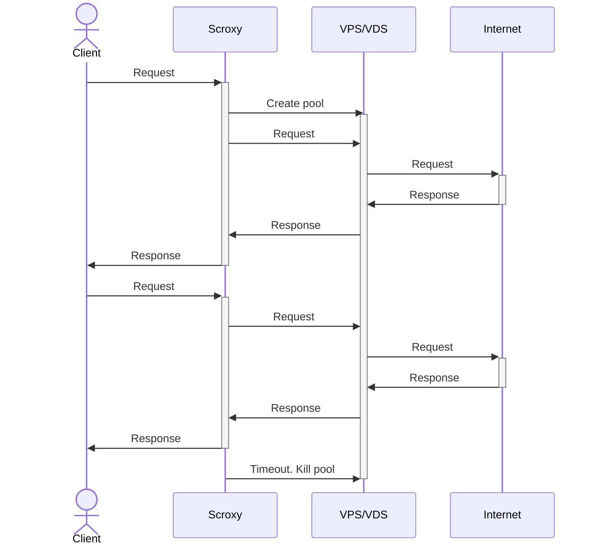

# scroxy
Scroxy (scrapper + proxy) is a smart proxy server to hide your scrapper behind
a pool of cloud proxies. When a request arrives, scroxy automatically deploys
a pool of droplets in DigitalOcean. After a timeout, droplets are killed to 
save resources.

## Description
